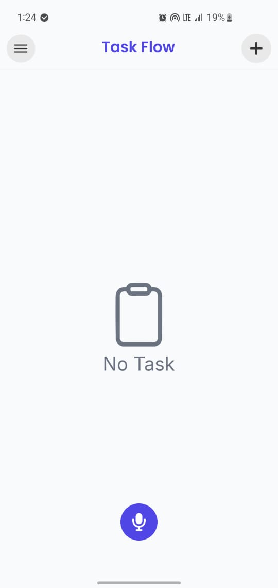
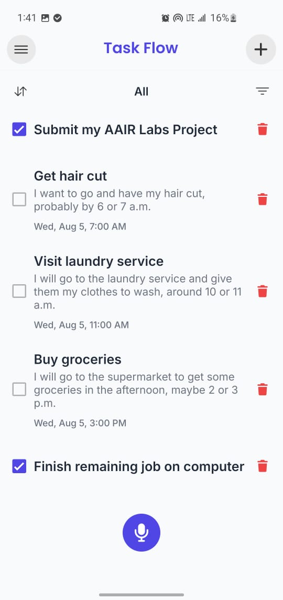
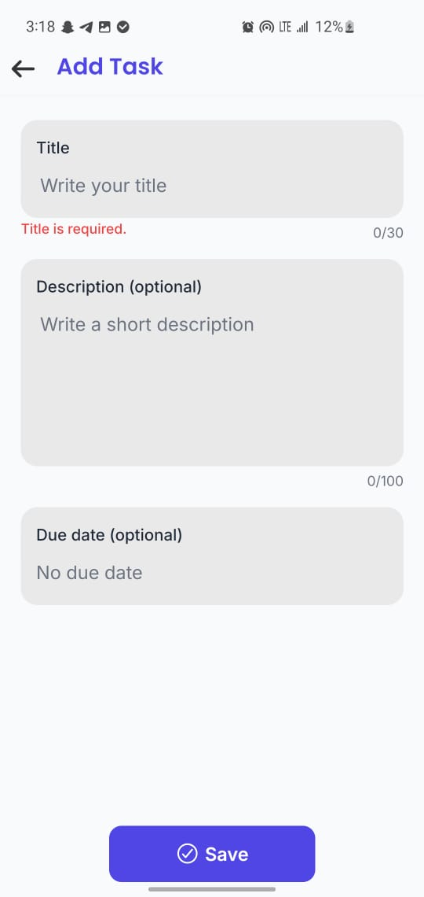
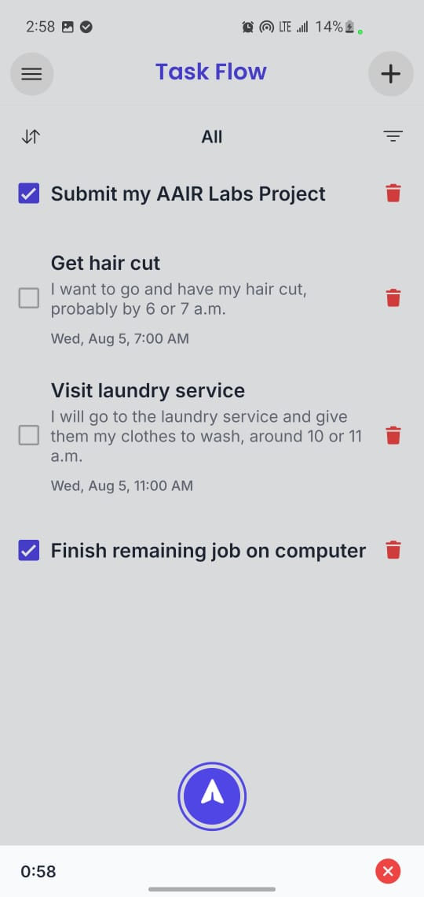
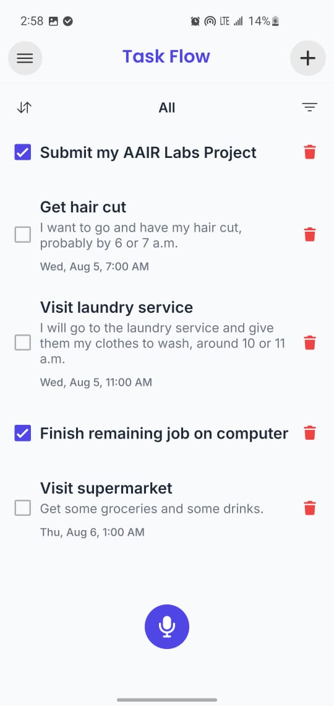
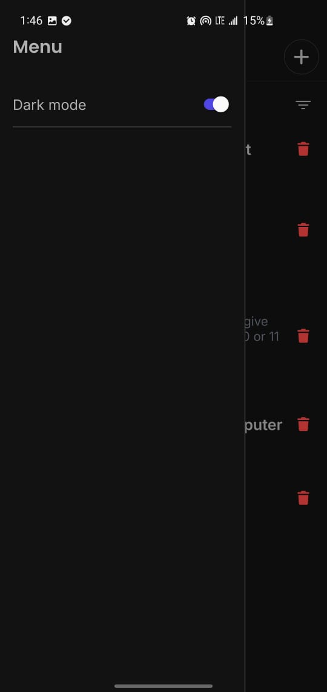
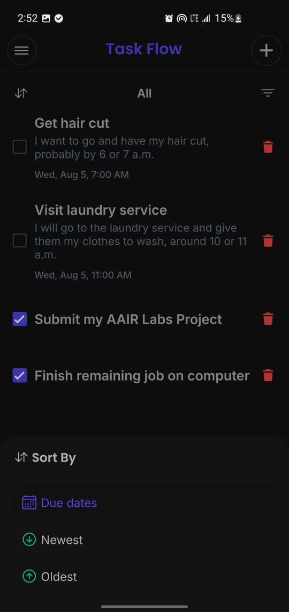
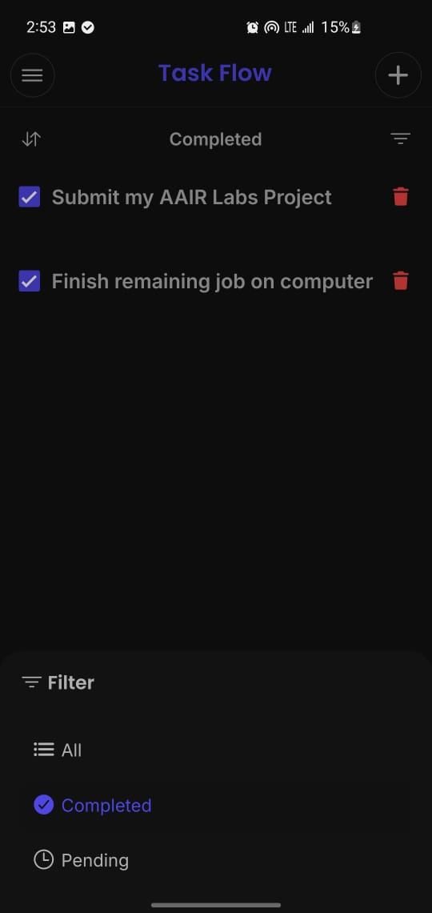

## Instructions on how to start the Application.


## Installation......................................

### 1. Clone the repository

```bash
git clone https://github.com/your-username/taskflow.git
```

### 2. Navigate to the project

```bash
cd taskflow
```

### 3. Install dependencies

```bash
npm install
```

### 4. Start the project
# To run the application on a physical Android device:

1. Enable **Developer Options** on your Android device.
2. Enable **USB Debugging**.
3. Connect your device to your computer using a USB cable.
4. Verify that your device is detected:

```bash
adb devices
```

5. Run the application:
```bash
npx expo run:android
```
    


## Environment Variables

Create a `.env` file in the project root:

```env
EXPO_PUBLIC_OPENAI_API_KEY=your_openai_api_key
```


## Task List Screen — empty state (no tasks)




## Task List Screen — with a mix of completed and incomplete tasks 




## Add Task Screen 




# Voice input mode (FAB active / listening) and the tasks it produced 






 # Bonus features
 


  # Sorting by due date
 


  # Filter Functionality
 

 

  # Voice Input Functionality

  


